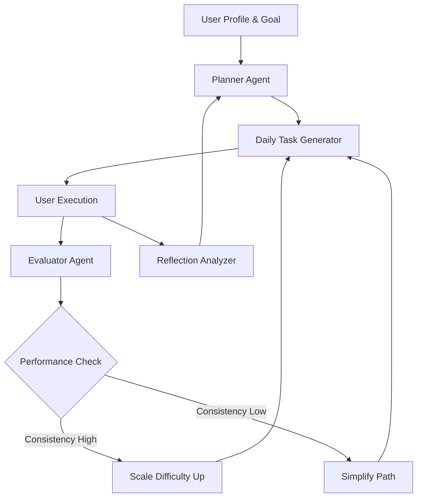
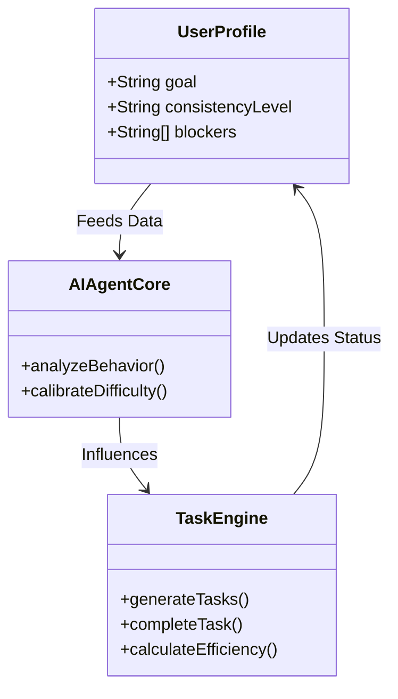

# ExecuStra — Transform Confusion into Absolute Clarity

### **You don't need another task manager. You need an Operating System for your life.**

ExecuStra is a high-fidelity, psychologically-aware execution system designed to bridge the gap between your highest goals and your daily reality. It removes decision fatigue by delivering a minimal, high-impact daily system that adapts to your performance and mental state.

---

## 📊 System Intelligence & Analytics

### **The Adaptive Execution Loop**
ExecuStra operates on a continuous feedback loop between your actions and our AI core.

### **Core Behavioral Metrics**
| Metric | Purpose | Target Level |
| :--- | :--- | :--- |
| **Execution Score** | Real-time completion velocity | > 85% |
| **Clarity Index** | Goal alignment & focus depth | High |
| **Resilience Multiplier** | Recovery speed after missed days | 1.2x |
| **Cognitive Load** | System-driven decision reduction | Minimum |

---

## ⚡ The Solution: Adaptive Execution

### **1. AI Agent Network**
The backend is powered by 5 specialized agents that work in parallel to ensure you never have to plan your own growth again.

*   **Planner Agent:** `[Roadmap Generation]`
*   **Task Generator:** `[Daily Micro-Action Synthesis]`
*   **Evaluator Agent:** `[Performance Pattern Recognition]`
*   **Adaptation Agent:** `[Dynamic Difficulty Scaling]`
*   **Reflection Analyzer:** `[Psychological Blocker Extraction]`

### **2. Visual Execution Analytics**
Track your evolution with high-density data visualizations integrated directly into your workspace.

**Monthly Consistency Trend**
`[ ▓▓▓▓▓▓▓▓▓▓▓▓▓▓▓▓▓▓▓▓▓▓▓▓▓▓▓▓▓▓▓▓ ] 92%`

**Daily Focus Allocation**
- **Skill Acquisition:** `██████████░░░░░ 65%`
- **Knowledge Base:** `██████░░░░░░░░░ 40%`
- **Mindset/Reflection:** `████████░░░░░░░ 55%`

---

## 💎 Elite Product Features

### **🌑 Midnight Glass Aesthetics**
Experience a workspace designed for deep focus. Our "Midnight Glass" interface uses a minimalist, obsidian-dark palette to reduce visual noise and promote entry into the Flow State.

### **🌊 Immersive Focus Suite**
- **Precision Pomodoro:** Calibrated for maximum cognitive endurance.
- **Ambient Soundscapes:** Choose between `Lofi`, `Rain`, or `Silence`.
- **Session Visualization:** Real-time progress rings and efficiency tracking.

### **📈 Execution Heatmap**
A professional 6-month visualization of your consistency. See your transformation from an "Overthinker" to an "Elite Executor" through a GitHub-style performance grid.

---

## 🛠️ Technical Architecture

---

### **Stop dreaming. Start executing.**
**[Mano Shruthi S](https://github.com/ManoShruthiS)** — *Architecting the future of human execution.*

---

Technical Specifications (Deep Dive)

#### **System Vitals**
- **Architecture:** Monorepo (FastAPI + React)
- **Frontend Core:** Vite, React 18, TailwindCSS, Framer Motion
- **Backend Core:** Python 3.10+, Pydantic V2, Uvicorn
- **Logic:** Rule-based AI Agents (Designed for LLM plug-and-play)
- **Design System:** Midnight Glass (Obsidian Dark Theme)

#### **Agent Capabilities**
| Agent | Primary Logic | Output |
| :--- | :--- | :--- |
| Planner | Goal Decomposition | 4-Week Roadmap |
| Task Gen | Contextual Micro-actions | 1-3 Daily Tasks |
| Evaluator | Statistical Regression | Completion Trends |
| Adaptation | Pressure Regulation | Difficulty Offset |
| Reflection | Sentiment & NLP | Blocker List |

