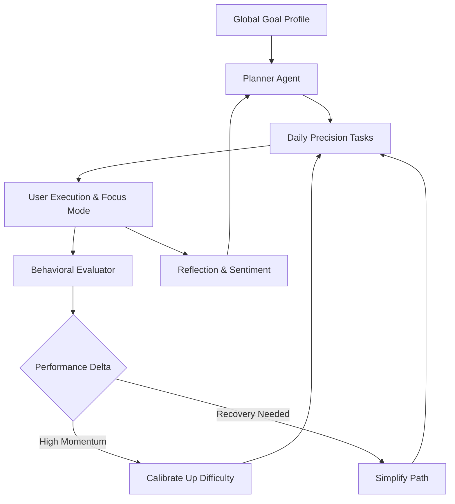

# ExecuStra: Adaptive Life Operating System

ExecuStra is a high-performance, psychologically-aware life operating system. It moves beyond standard task management by utilizing an adaptive execution loop that calibrates daily roadmaps based on user consistency, cognitive load, and real-time performance velocity.

---

## ⚡ System Architecture & Execution Flow

The platform operates on a feedback loop designed to prevent burnout while maximizing output.



### **Core Capabilities**
*   **Dynamic Task Generation**: Personalized daily tasks based on defined professional goals (e.g., AI Engineer, Data Scientist).
*   **Execution Tracking**: Real-time progress rings, streak calculation, and completion velocity metrics.
*   **Deep Focus Engine**: Integrated Pomodoro timer for calibrated cognitive endurance.
*   **Midnight Glass UI**: A professional, distraction-free aesthetic utilizing obsidian palettes and fluid Framer Motion animations.
*   **Unified Deployment**: A streamlined architecture serving both the FastAPI backend and React frontend via a single Dockerized web service.

---

## 🛠️ Technical Stack

**Frontend Framework**
*   **Core**: React 19, Vite
*   **Styling**: TailwindCSS, Framer Motion
*   **State Management**: React Context API
*   **Icons**: Lucide React

**Backend Infrastructure**
*   **Core**: FastAPI (Python 3.11)
*   **Validation**: Pydantic V2
*   **Server**: Uvicorn
*   **Database (Planned/Integration)**: Supabase

**Deployment & DevOps**
*   **Platform**: Render
*   **Containerization**: Docker (Multi-stage build)
*   **Routing**: Unified SPA fallback routing via FastAPI

---

## 🚀 Setup & Local Execution

ExecuStra is designed as a Monorepo. You can run the unified application locally or build the separate environments.

### **Unified Docker Execution (Production Mirror)**
```bash
# Build the unified container
docker build -t execustra-app .

# Run the application
docker run -p 10000:10000 execustra-app
```
*The application will be accessible at `http://localhost:10000`.*

### **Local Development (Split Servers)**

**1. Backend (FastAPI)**
```bash
cd backend
pip install -r requirements.txt
uvicorn app.main:app --reload --port 8000
```

**2. Frontend (React + Vite)**
```bash
cd frontend
npm install
npm run dev
```

---

## 👤 The Architect
**[Mano Shruthi S](https://github.com/ManoShruthiS)**
*Lead Developer & System Architect*
