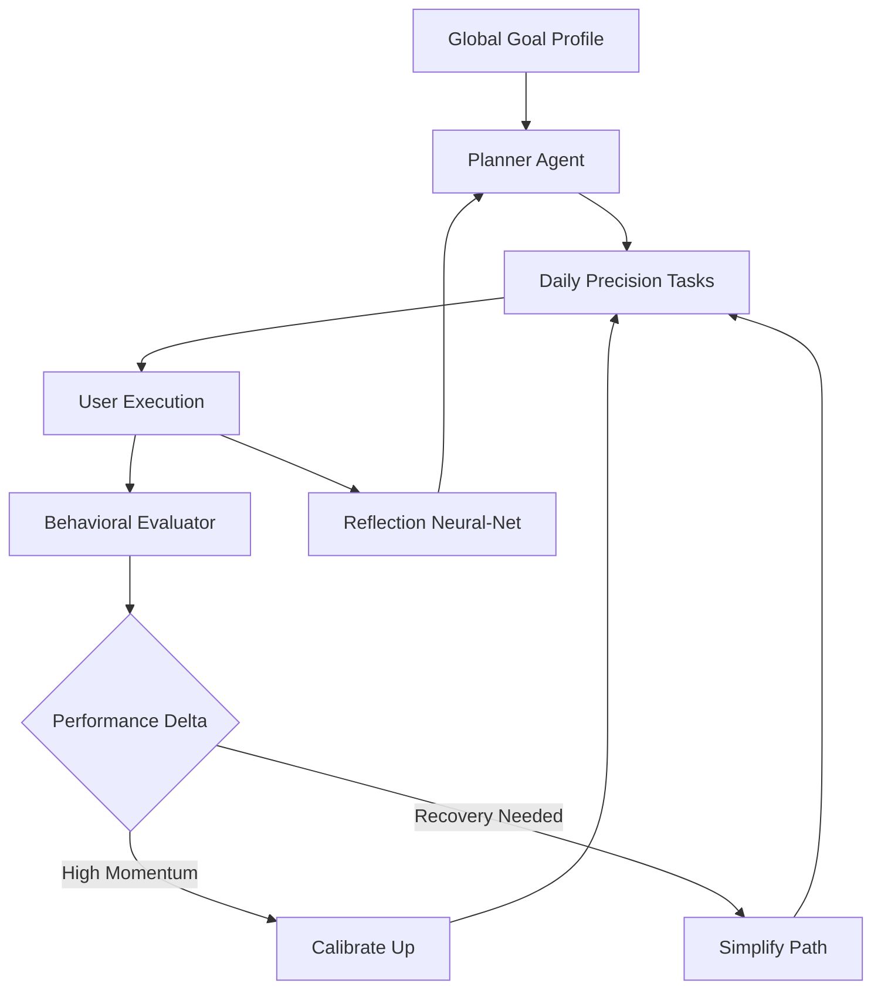
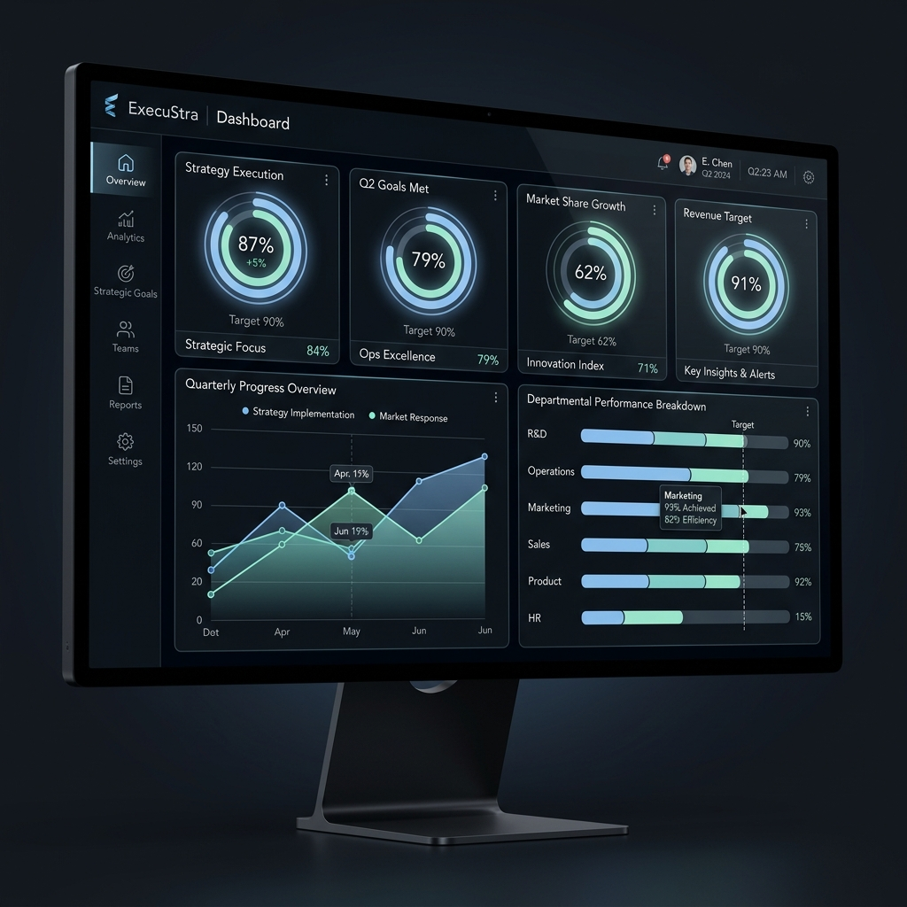
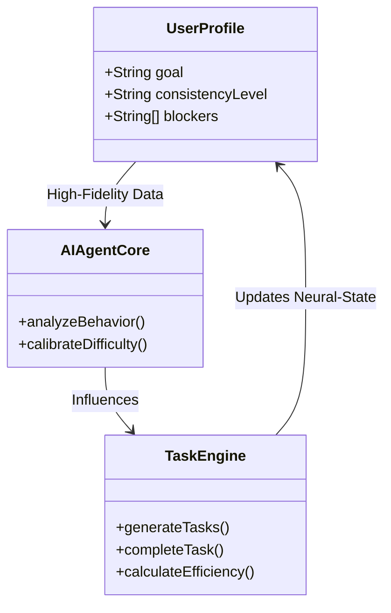

# 

# ExecuStra: The Elite Life Operating System
### **"Clarity is the ultimate sophisticated weapon. Own yours."**

ExecuStra is not just another task manager. It is a **high-fidelity, psychologically-aware execution system** designed for those who demand absolute clarity and uncompromising performance. By leveraging a network of specialized AI agents, ExecuStra transforms the chaos of ambition into a precision-engineered daily roadmap.

---

## ⚡ The Adaptive Execution Loop
Stop overthinking. Start executing. Our system recalibrates your path in real-time based on your cognitive load and performance velocity.



### **Core Behavioral Intelligence**
| Metric | Purpose | Target Level |
| :--- | :--- | :--- |
| **Execution Score** | Real-time completion velocity | **> 85%** |
| **Clarity Index** | Goal alignment & focus depth | **Elite** |
| **Resilience Multiplier** | Recovery speed after missed days | **1.2x** |
| **Cognitive Load** | System-driven decision reduction | **Minimum** |

---

## 💎 Midnight Glass Aesthetics
**Deep Focus is the New Luxury.**
Experience a workspace designed for deep cognitive flow. Our "Midnight Glass" interface uses an obsidian-dark palette and glassmorphism elements to eliminate visual noise and center your consciousness on the task at hand.



### **Key Performance Modules:**
*   **Precision Pomodoro:** Calibrated for elite cognitive endurance.
*   **Circular Execution Rings:** High-fidelity visual feedback on your daily momentum.
*   **Execution Heatmap:** A professional 6-month visualization of your consistency.
*   **Ambient Soundscapes:** Integrated audio environments (Lofi, Rain, Silence).

---

## 🧠 AI Agent Network (Core Intelligence)
The backend is powered by 5 specialized agents working in high-speed parallel to ensure you never have to plan your own growth again:
1.  **Planner Agent:** High-level roadmap synthesis and long-term goal decomposition.
2.  **Task Generator:** Daily micro-action contextualization for immediate execution.
3.  **Evaluator Agent:** Statistical performance recognition and pattern analysis.
4.  **Adaptation Agent:** Dynamic difficulty scaling based on real-time behavioral data.
5.  **Reflection Analyzer:** Psychological blocker extraction and sentiment processing.

---

## 🛠️ System Architecture


---

## 👤 The Architect
**[Mano Shruthi S](https://github.com/ManoShruthiS)**
*Architecting the future of human execution through high-fidelity systems.*

---

<details>
<summary>Technical Specifications & Stack</summary>

- **Architecture:** Monorepo (FastAPI + React)
- **Frontend:** React 18, Vite, TailwindCSS (Custom Theme), Framer Motion.
- **Backend:** FastAPI (Python 3.10+), Pydantic V2, Uvicorn.
- **AI Logic:** Specialized Rule-based Agents (Designed for LLM plug-and-play).
- **Design System:** Midnight Glass (Obsidian Dark Theme).

### **Setup & Execution**
```bash
# 1. Clone the repository
git clone https://github.com/ManoShruthiS/Execustra.git

# 2. Backend Initialization
cd backend
pip install -r requirements.txt
uvicorn app.main:app --reload

# 3. Frontend Initialization
cd ../frontend
npm install
npm run dev
```
</details>

---
