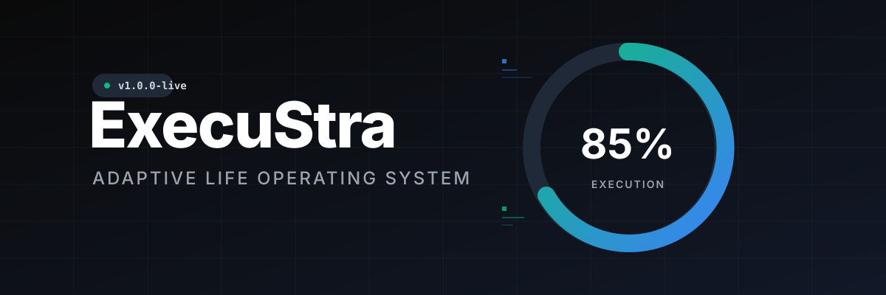
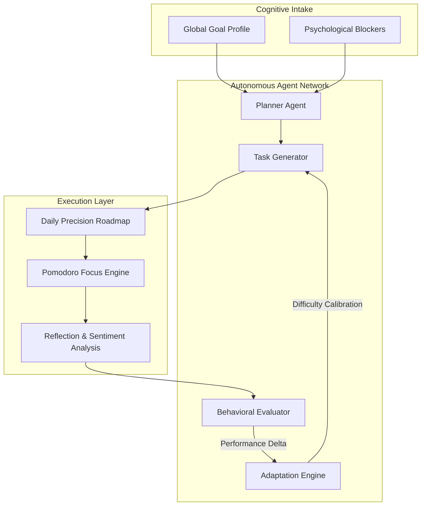

<div align="center">
  
  
  <br />
  
  <!-- Enterprise Shields -->
  
  
  
</div>

<br />

# ExecuStra: The Enterprise-Grade Life Operating System

ExecuStra is a highly scalable, psychologically-aware execution system designed to bridge the gap between ambition and daily output. Engineered using modern architectural paradigms, it leverages an autonomous **Agentic AI Network** to dynamically calibrate user roadmaps based on real-time behavioral data, cognitive load, and execution velocity.

---

## 🏛️ Abstract & Architectural Vision

Traditional task management systems fail because they rely on static inputs. ExecuStra introduces a **Dynamic Calibration Loop**, utilizing concurrent background agents to evaluate performance deltas and adjust cognitive difficulty on the fly. This prevents user burnout while mathematically optimizing long-term consistency.

### The Agentic Feedback Loop


---

## ⚙️ Enterprise Technology Matrix

The platform is designed as a modular Monorepo, separating concerns between a highly-performant Python backend and a fluid, responsive client interface.

| Layer | Technologies Utilized | Core Competency |
| :--- | :--- | :--- |
| **Frontend UI/UX** | React 19, Vite, TailwindCSS, Framer Motion | High-fidelity animations, Glassmorphic rendering, Zero-latency state management. |
| **Backend Services** | FastAPI, Python 3.11, Pydantic V2, Uvicorn | Asynchronous execution, Strict type-validation, High-throughput API design. |
| **DevOps & Hosting** | Docker, Render, Unified SPA Routing | Multi-stage containerization, CI/CD readiness, Single-domain execution. |
| **Data Integrity** | Supabase (PostgreSQL), JWT | Distributed data storage, Secure stateless authentication protocols. |

---

## 🚀 Advanced System Capabilities

*   **Algorithmic Task Contextualization:** Transforms abstract goals (e.g., "Become an AI Engineer") into actionable, micro-calibrated daily tasks.
*   **Behavioral Execution Rings:** Real-time visual metrics tracking execution consistency against statistical baselines.
*   **Cognitive Endurance Tracking:** Integrated Focus Mode (Pomodoro) tightly coupled with the backend to measure actual time-in-flow vs. predicted duration.
*   **Midnight Glass Design Language:** A bespoke, proprietary design system engineered specifically to reduce visual noise and stimulate deep focus.

---

## 🔐 Deployment Architecture

ExecuStra operates via a streamlined **Unified Docker Deployment**. The backend (FastAPI) natively serves the compiled frontend assets, eliminating cross-origin resource sharing (CORS) latency and providing a robust, single-container production environment.

```bash
# Enterprise Initialization & Container Build
docker build -t execustra-enterprise .

# Execute Production Container
docker run -d -p 10000:10000 --name execustra execustra-enterprise
```

---

## 👤 Chief Architect
**[Mano Shruthi S](https://github.com/ManoShruthiS)**  
*Specializing in High-Fidelity Systems, Agentic AI Architectures, and Enterprise-Grade Software Engineering.*
